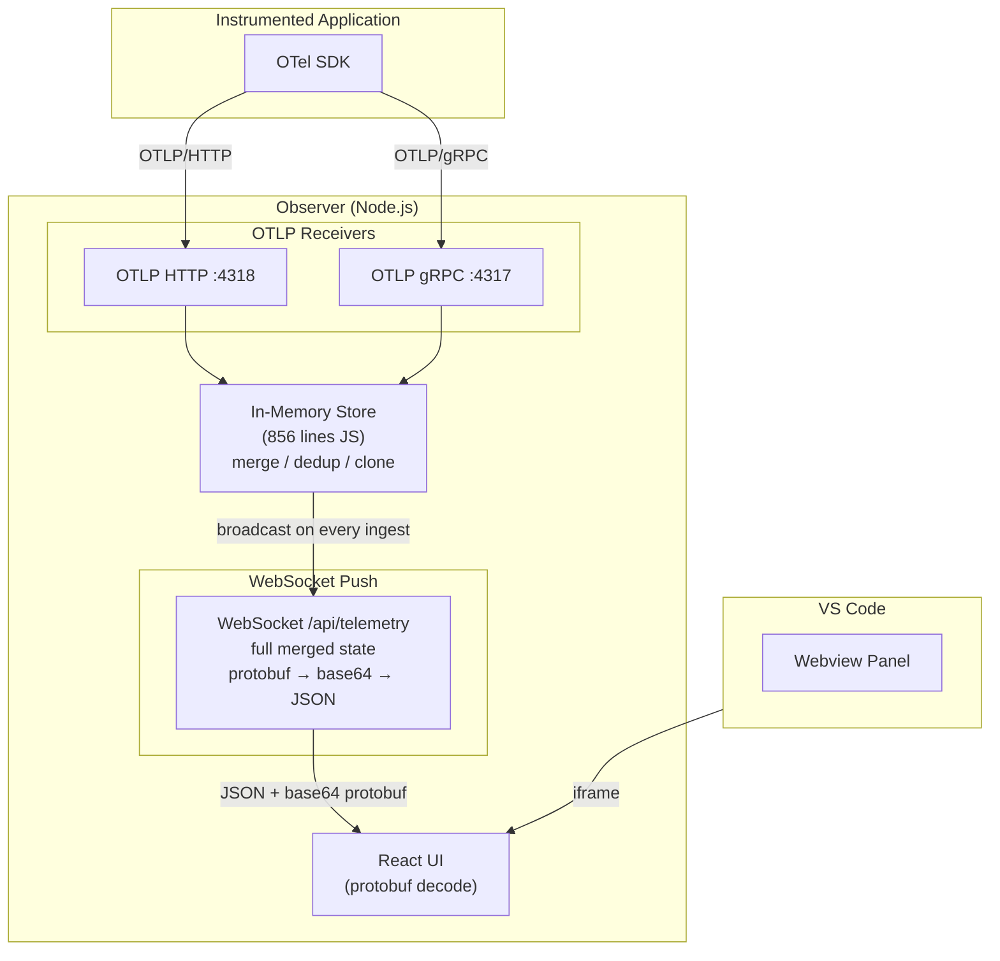
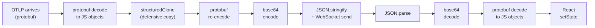
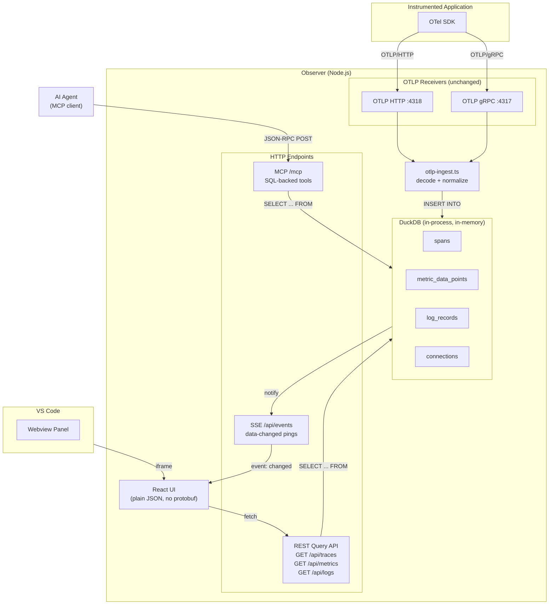
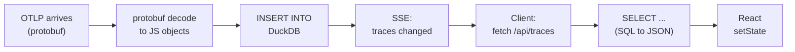
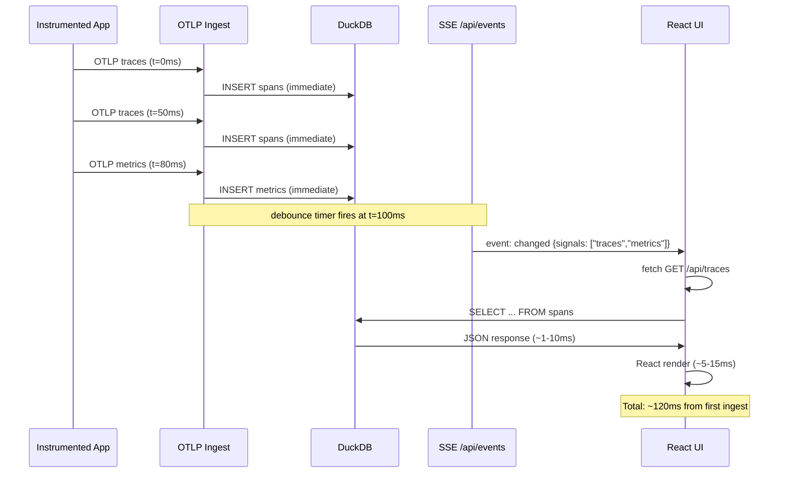
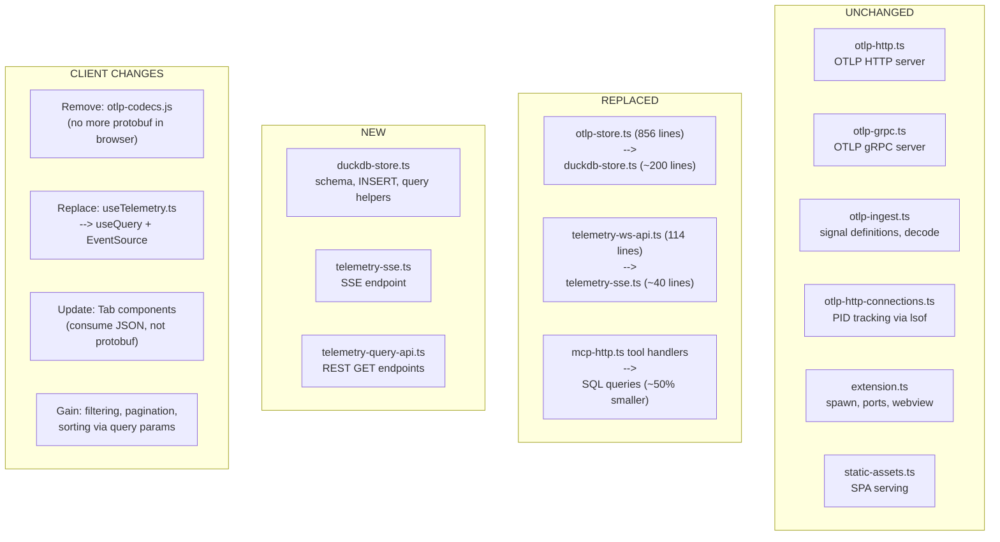

# Observer Storage Layer: Current State and DuckDB + SSE Proposal

## Current Architecture

The Observer is a local OpenTelemetry telemetry viewer that receives, stores, and displays traces, metrics, and logs emitted by an instrumented application. It runs as a Node.js process spawned by a VS Code extension, which embeds the Observer's React UI in a webview iframe.

### How data flows today



Instrumented applications send telemetry via OTLP/HTTP (port 4318) or OTLP/gRPC (port 4317). The Observer decodes each payload from protobuf, then persists it in a custom in-memory store (`observer/server/src/otlp-store.ts`, 856 lines). The store implements hand-rolled merge and deduplication logic:

- **Traces**: merged by `traceId`, spans deduplicated by `spanId`, capped at 100 traces, ordered into parent-child trees
- **Metrics**: merged by resource key, scope key, metric name, and data-point attribute-set key (incoming data points replace prior values at the same key)
- **Logs**: full replacement per source connection, concatenated across sources

Each source is tracked by `connectionId` (HTTP via `lsof` PID lookup, gRPC via HTTP/2 session). When a source disconnects, its data is evicted and the entire merged state is recomputed.

After every ingest, the store broadcasts the full merged state to the React UI via a WebSocket at `/api/telemetry`. The payload is protobuf-encoded, base64-wrapped, and JSON-enveloped. The client decodes this chain in reverse (JSON parse, base64 decode, protobuf decode) to produce React state. The UI has no filtering, pagination, or search -- it receives everything and renders it all.

A separate MCP endpoint (`/mcp`, 1107 lines in `observer/server/src/mcp-http.ts`) exposes four read-only tools for AI agents, each implemented as hand-written JS traversals over the same in-memory store.

### Serialization path (current)



Six serialization hops for data that never leaves localhost.

### Pain points

- **856 lines of merge logic** that is fragile, hard to extend, and duplicates work that a database does natively (deduplication, aggregation, sorting, filtering).
- **Full-state broadcast on every change** -- every metric update ships all metrics; every new span ships all traces. No incremental updates, no server-side filtering.
- **Double serialization round-trip** -- six serialization steps between ingest and UI render for data that never leaves localhost.
- **No query capability** -- the UI cannot filter by service, status, time range, or metric name. The MCP tools implement their own filtering in ~500 lines of JS.
- **No foundation for the Validator** -- the planned golden telemetry comparison (approximate matching, ranking scores) would require yet more custom JS data-diffing logic.

---

## Proposed Architecture: DuckDB + SSE

### What changes

Replace the in-memory JS store with **DuckDB** (embedded, in-process). Replace the WebSocket with **Server-Sent Events (SSE)** for change notifications and **REST query endpoints** for data retrieval.

### Architecture diagram



### How data flows with DuckDB

OTLP ingestion is unchanged (same HTTP and gRPC servers, same decode logic). Instead of calling custom merge functions, the ingest layer executes `INSERT` statements into DuckDB tables (`spans`, `metric_data_points`, `log_records`, `connections`). DuckDB handles deduplication via `INSERT OR REPLACE` keyed on `(trace_id, span_id)` for spans and `(metric_name, connection_id, attributes_key)` for metrics.

After each insert (debounced at ~100ms), the server emits a lightweight SSE event to all connected browser clients. The client's `EventSource` listener triggers a `fetch` to a REST query endpoint. The server runs a SQL query against DuckDB and returns plain JSON. The React UI renders the result directly.

### Serialization path (proposed)



Two serialization boundaries instead of six. No protobuf codecs needed in the browser.

### Real-time updates: debounced SSE + REST fetch

The design doc requires "sub-second end-to-end latency from telemetry receipt to display in the UI." The SSE + REST approach meets this easily:



Latency budget on localhost:

| Step                              | Latency   |
| --------------------------------- | --------- |
| SSE push (server to browser)      | <1ms      |
| Client receives, triggers fetch   | <1ms      |
| HTTP request (localhost)          | ~1-3ms    |
| DuckDB SQL query (in-memory)     | ~1-10ms   |
| JSON response to client          | ~1-3ms    |
| React setState + render          | ~5-15ms   |
| **Total (after debounce)**       | **~10-30ms** |

The 100ms debounce window is configurable. At high telemetry rates, it batches multiple ingests into a single UI update. At low rates, the debounce fires almost immediately. Either way, well under the sub-second requirement.

Benefits over the current WebSocket approach:
- Client only fetches data for the active tab, not all three signals
- Server-side filtering reduces payload size
- No protobuf encode/decode round-trip
- SSE has native browser auto-reconnect (no custom reconnect logic needed)

### DuckDB schema

```sql
CREATE TABLE spans (
  trace_id            VARCHAR NOT NULL,
  span_id             VARCHAR NOT NULL,
  parent_span_id      VARCHAR,
  span_name           VARCHAR NOT NULL,
  kind                INTEGER,
  start_time_unix_nano BIGINT,
  end_time_unix_nano  BIGINT,
  status_code         INTEGER,
  status_message      VARCHAR,
  attributes          JSON,
  resource_attributes JSON,
  scope_name          VARCHAR,
  scope_version       VARCHAR,
  schema_url          VARCHAR,
  connection_id       VARCHAR,
  ingested_at         TIMESTAMP DEFAULT now(),
  PRIMARY KEY (trace_id, span_id)
);

CREATE TABLE metric_data_points (
  metric_name         VARCHAR NOT NULL,
  metric_type         VARCHAR NOT NULL,
  description         VARCHAR,
  unit                VARCHAR,
  is_monotonic        BOOLEAN,
  temporality         VARCHAR,
  value               DOUBLE,
  count               BIGINT,
  sum                 DOUBLE,
  min                 DOUBLE,
  max                 DOUBLE,
  bucket_counts       JSON,
  explicit_bounds     JSON,
  quantiles           JSON,
  attributes          JSON,
  attributes_key      VARCHAR NOT NULL,
  resource_attributes JSON,
  scope_name          VARCHAR,
  scope_version       VARCHAR,
  schema_url          VARCHAR,
  start_time_unix_nano BIGINT,
  time_unix_nano      BIGINT,
  connection_id       VARCHAR,
  ingested_at         TIMESTAMP DEFAULT now(),
  PRIMARY KEY (metric_name, connection_id, attributes_key)
);

CREATE TABLE log_records (
  timestamp_unix_nano    BIGINT,
  observed_time_unix_nano BIGINT,
  severity_number        INTEGER,
  severity_text          VARCHAR,
  body                   VARCHAR,
  attributes             JSON,
  resource_attributes    JSON,
  scope_name             VARCHAR,
  trace_id               VARCHAR,
  span_id                VARCHAR,
  connection_id          VARCHAR,
  ingested_at            TIMESTAMP DEFAULT now()
);

CREATE TABLE connections (
  connection_id VARCHAR PRIMARY KEY,
  transport     VARCHAR,
  pid           INTEGER,
  created_at    TIMESTAMP DEFAULT now(),
  last_seen_at  TIMESTAMP DEFAULT now()
);
```

### REST query API

| Endpoint                    | DuckDB query                                                                 | Purpose                          |
| --------------------------- | ---------------------------------------------------------------------------- | -------------------------------- |
| `GET /api/traces`           | `SELECT trace_id, min(start_time_unix_nano), count(*), ... GROUP BY trace_id ORDER BY ... LIMIT` | List traces with summaries       |
| `GET /api/traces/:traceId`  | `SELECT * FROM spans WHERE trace_id = ? ORDER BY start_time_unix_nano`       | Full span tree for one trace     |
| `GET /api/metrics`          | `SELECT metric_name, metric_type, count(*) GROUP BY 1,2 ORDER BY 1`         | List metrics with point counts   |
| `GET /api/metrics/:name`    | `SELECT * FROM metric_data_points WHERE metric_name = ?`                     | All data points for one metric   |
| `GET /api/logs`             | `SELECT * FROM log_records ORDER BY timestamp_unix_nano DESC LIMIT`           | Recent log records               |
| `GET /api/stats`            | Count queries across all tables                                              | Summary counts for status bar    |

All endpoints support query parameters for filtering (`?service=foo&status=error`), pagination (`?limit=50&offset=0`), and sorting.

### What stays the same

- OTLP HTTP and gRPC servers (unchanged)
- `otlp-ingest.ts` signal definitions and decode (unchanged)
- `otlp-http-connections.ts` PID tracking (unchanged)
- VS Code extension lifecycle, port management, webview (unchanged)
- Static asset serving (unchanged)
- MCP endpoint structure and JSON-RPC handling (unchanged, only tool handlers simplified)

### What improves

| Dimension                  | Before                                            | After                                    |
| -------------------------- | ------------------------------------------------- | ---------------------------------------- |
| Store complexity           | 856 lines of custom JS                            | ~200 lines: DDL schema + INSERT helpers  |
| Data delivery              | Full merged state on every change                 | Query only what the UI tab needs         |
| Serialization              | 6 hops (proto, clone, proto, b64, JSON, reverse)  | 2 hops (proto decode, SQL to JSON)       |
| Client protobuf dependency | Required (otlp-codecs.js bundled)                 | Eliminated (plain JSON)                  |
| Filtering and search       | Not supported                                     | SQL WHERE clauses via query params       |
| Pagination                 | Not supported                                     | SQL LIMIT/OFFSET                         |
| Connection eviction        | Recompute entire merged state                     | `DELETE WHERE connection_id = ?`         |
| MCP tool handlers          | ~550 lines of JS traversals                       | ~200 lines wrapping SQL                  |
| Trace cap                  | Hard-coded 100                                    | Configurable via SQL windowing           |

### What it unlocks

- **Validator**: Golden telemetry comparison becomes SQL JOINs between `spans` / `metric_data_points` and `golden_spans` / `golden_metric_data_points` tables, with similarity scoring via SQL aggregation. No custom diffing code needed.
- **Probabilistic testing**: The ranking-score framework described in the product spec (compare output telemetry to expected golden, produce a conformance score) maps naturally to SQL.
- **Telemetry snapshots**: DuckDB's native Parquet and JSON export/import enables saving and loading golden recordings without custom serialization.
- **Future UI features**: Time-range filtering, attribute search, metric charting over time, span latency histograms -- all become trivial SQL queries served over REST.

### DuckDB packaging: WASM vs native

| Option                      | Platform-specific? | Performance  | Bundle size | Packaging complexity |
| --------------------------- | ------------------ | ------------ | ----------- | -------------------- |
| `duckdb-wasm` (WASM)        | No (universal)     | Good (~2-5x slower than native) | ~10-20MB    | Simple -- just JS + WASM |
| `@duckdb/node-api` (native) | Yes (prebuilt per platform) | Best         | ~15MB/platform | Moderate -- platform binaries |

Recommendation: Start with `duckdb-wasm` for portability. The Observer processes one application's telemetry locally -- WASM performance is more than sufficient. Migrate to native bindings if profiling shows a bottleneck.

### Risk and mitigation

- **Dependency size**: DuckDB WASM is ~10-20MB. For a VS Code extension that already bundles a full React app and OTLP protobuf bindings, this is acceptable.
- **Schema evolution**: New OTLP fields or Validator tables require migrations. Mitigate by using DuckDB's in-memory mode (no persistent files to migrate) and recreating schema on startup.
- **Learning curve**: Team needs basic SQL familiarity for store and query code. The SQL involved is straightforward (INSERT, SELECT, JOIN, GROUP BY).

### Before vs after: what changes, what stays



---

## Implementation steps

1. Add DuckDB dependency (`duckdb-wasm` or `@duckdb/node-api`) to `observer/server`
2. Create DuckDB schema module: `spans`, `metric_data_points`, `log_records`, `connections` tables with DDL
3. Implement `duckdb-store.ts`: INSERT helpers for each signal, connection eviction, change notification emitter with debouncing
4. Implement REST query endpoints: `GET /api/traces`, `/api/traces/:id`, `/api/metrics`, `/api/metrics/:name`, `/api/logs`, `/api/stats`
5. Implement SSE endpoint at `/api/events` replacing WebSocket `telemetry-ws-api.ts`
6. Refactor MCP tool handlers to use SQL queries against DuckDB instead of JS traversals
7. Replace client `useTelemetry` WebSocket hook with `useQuery` + `EventSource` hooks (drop protobuf codecs from client bundle)
8. Update `TracesTab`, `MetricsTab`, `LogsTab` to consume JSON from REST API and support filtering/pagination
9. Update `otlp-ingest.ts` persist functions to call `duckdb-store` INSERT instead of `otlpInMemoryStore`
10. Remove `otlp-store.ts`, `telemetry-ws-api.ts`, client `otlp-codecs.js`, and shared telemetry WebSocket types
11. Verify end-to-end: OTLP ingest -> DuckDB -> SSE -> REST query -> UI rendering
