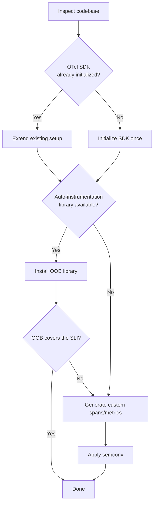

# Observability Studio Skills -- Product Requirements Document

**Author**: Tigran Najaryan, with AI skill specifications by Platform Engineering
**Status**: Draft
**Version**: 0.2

---

## 1. Executive Summary

Observability Studio is a developer tool that helps instrument (make
observable) applications and services, verify the telemetry emitted by
instrumentation, and iterate and improve instrumentation quickly.

The Studio is a free, open-source product, marketed through our OpenTelemetry
channels. It is a no-strings-attached tool that can be used by developers
using any Observability backend. On top of that, developers get additional
capabilities when they use it with a supported observability backend.

### Components

| Component | Purpose | Delivery |
|-----------|---------|----------|
| **Instrumenter** | Agent skills to add OpenTelemetry instrumentation to any codebase | Markdown files consumed by AI agents |
| **Telemetry Explorer** | Receive, store, and visualize OTLP telemetry in real time | Web UI on `localhost:3000` |
| **Validator** | Check telemetry conformance to OTel standards via OTel Weaver | CLI mode and visual overlay in Explorer |
| **Terraformer** | Generate observability terraform (dashboards, detectors) | Agent skills |
| **IDE Extension** | Package all components as a VS Code extension | VS Code Marketplace |

### Business Goals

1. **Brand image**: Improve the project's reputation as a developer-friendly,
   open-source-supporting company and increase brand awareness in the
   developer community.
2. **Customer acquisition**: Create a new funnel via optional Terraformer
   functionality that leads users to O11y Cloud.

Brand image considerations always take precedence. The Studio must never
feel like an ad platform.

### Success KPIs

| KPI | Target | Timeline |
|-----|--------|----------|
| Internal: O11y Cloud services instrumented with high-quality custom telemetry | 50% of services | June 2026 |
| Public: VS Code extension installs | 1,000 installations | June 2026 |
| First-run telemetry emission rate | >= 90% | Ongoing |
| Semantic convention compliance | >= 95% | Ongoing |
| Eval pass rate (CI) | >= 85% | Ongoing |
| Time-to-instrumented | < 2 min | Ongoing |

---

## 2. Architecture

Observability Studio follows a layered architecture where each layer is
independently useful. See `docs/architecture-proposal.md` for the full
design.

```
Layer 3: Distribution (VS Code extension, brew, npx, go install)
Layer 2: obstudio CLI (start, register, skill installer)
Layer 1: Core (Skills + Observer)
```

### Skills + Observer Composition

Skills tell the agent *what to do*. The Observer tells the agent *what
happened*. Together they form a closed loop:

1. Agent reads skill -- instruments the code
2. Developer runs the app
3. App sends OTLP to Observer (`localhost:4318`)
4. Agent calls MCP tools -- inspects telemetry
5. Agent fixes issues -- go to step 2

### Skill Folder Structure

```
skills/otel-observe/
  SKILL.md                      # Lean workflow: audit -> plan -> implement -> verify
  languages/
    node.md                     # Node.js-specific (loaded on-demand)
    python.md                   # Python-specific (loaded on-demand)
    go.md                       # Go-specific (loaded on-demand)
  references/                   # Shared reference material
    fault-domain-patterns.md
    signal-mapping-guide.md
    observability-template.md
```

Token-conscious design: the agent loads SKILL.md (~180 lines) plus only
the one language file matching the detected codebase (~200 lines). Reference
files are loaded only when the specific workflow step executes them.

### MCP Tools (Observer)

| MCP Tool | Purpose |
|----------|---------|
| `observer_metrics_overview` | List metrics with filters |
| `observer_metric_detail` | Fetch one metric with full datapoint history |
| `observer_traces_overview` | List recent traces with span previews |
| `observer_trace_detail` | Fetch one trace with all spans, events, links |

Endpoint: `http://localhost:3000/mcp` (Streamable HTTP, standard MCP).

---

## 3. Target Personas

### Persona A: Application Developer

- **Goal**: Add observability without becoming an OTel expert.
- **Typical prompt**: "Add tracing to this Flask app", "Instrument my Express
  API with OpenTelemetry".
- **Success criteria**: "It works on first run, I didn't have to read any docs."

### Persona B: Platform Engineer

- **Goal**: Standardize instrumentation across 20+ services. Enforce semantic
  conventions and metric naming.
- **Typical prompt**: "Instrument this service following our platform standards".
- **Skill interaction**: Configures via `.observability.md` to define expected
  KPIs. Reviews output for compliance.
- **Success criteria**: "Every service produces the same signal names."

### Persona C: SRE / On-Call Engineer

- **Goal**: Quickly add targeted instrumentation to diagnose a production issue.
- **Typical prompt**: "Add a span around the database retry logic".
- **Success criteria**: "I got the exact signal I needed in < 5 minutes."

---

## 4. Unified `/otel-observe` Skill

The Instrumenter is delivered as a single unified skill (`skills/otel-observe/`)
that combines observability audit and OpenTelemetry implementation into one
flow. The agent can run the full audit or skip directly to instrumentation.

### 4.1 Workflow

| Step | Action | Files Loaded |
|------|--------|--------------|
| 1 - Discovery | Detect language, framework, existing OTel, entry points | `languages/<detected>.md` |
| 2 - Component Mapping | Identify external deps and internal layers | (none) |
| 3 - Fault Domain Analysis | Assess failure modes per component | `skills/references/fault-domain-patterns.md` |
| 4 - SLI Identification | Four golden signals + business SLIs | (none) |
| 5 - Signal Mapping | Build SLI definitions and signal tables (Spans/Metrics/Logs) | `skills/references/signal-mapping-guide.md` |
| 6 - Generate .observability.md | Write audit document | `skills/references/observability-template.md` |
| 7 - Implement | Install OOB libraries, generate custom spans/metrics | (language file already loaded) |
| 8 - Verify | Run app, check telemetry via Observer MCP | (none) |
| 9 - Alerts | Add alert definitions to .observability.md | (none) |

### 4.2 OOB vs Custom Decision Framework



- **OOB**: use when a stable auto-instrumentation library exists (see
  language files for per-language library maps)
- **Custom**: use when no OOB library exists, OOB coverage is too coarse,
  business metrics are needed, or the signal is Category: Custom

### 4.3 Semantic Convention Enforcement

**Span naming**: `{component}.{operation}`, low-cardinality, stable semconv
attribute keys.

**Attribute naming**: registered semconv attributes first; custom attributes
follow `{domain}.{noun}.{adjective}` pattern; no high-cardinality values.

**Metric naming**: `{namespace}.{noun}.{unit}`; histograms for latency,
counters for throughput, gauges for current state.

**Error handling**: set span status to ERROR, call `recordException()`,
include `error.type` attribute on error metrics.

### 4.4 Trigger Rules

| Confidence | Trigger | Action |
|------------|---------|--------|
| High | User says "instrument", "add opentelemetry", "/observe" | Auto-activate |
| Medium | Framework detected without OTel deps | Suggest activation |
| Medium | `.observability.md` present with gaps | Suggest activation |
| Low | New file created, dep update, OTel error | Do not activate |

---

## 5. Non-Functional Requirements

### 5.1 Determinism

Structural elements must be identical across runs:
- SDK initialization location and pattern
- Auto-instrumentation library selection
- Semantic convention attribute keys
- OTLP exporter configuration

Stylistic variance is acceptable:
- Variable naming, import ordering
- Exact span placement within functions
- Async pattern choice

### 5.2 Evaluation Framework

Skills are non-deterministic. Testing uses probabilistic evals with fuzzy
verification against golden results.

**Eval types**:

| Type | What It Tests | Pass Criteria |
|------|---------------|---------------|
| Structural | Single SDK init, correct OOB libraries | Exact match |
| Semantic convention | Span/metric/attribute names follow semconv | Exact match |
| Golden comparison | Full output vs reference | >= 80% structural similarity |
| Telemetry emission | Run app, verify OTLP received by Observer | Expected signals present |
| Idempotency | Run skill twice | Second run makes no/minimal changes |
| Cross-run consistency | Run skill N times | >= 85% of runs pass structural checks |

**Eval fixtures**: example codebases in supported languages representing
common archetypes (Web Service, Data Store, Batch Processor, Queue Consumer).

**Eval tooling**: deepeval with LLM-as-judge (GEval) rubrics for golden
comparison, custom pytest assertions for structural and semconv checks,
integration tests for telemetry emission using the Observer MCP tools.

### 5.3 Versioning

- Language files specify minimum OTel SDK versions.
- Library maps are updated when OTel releases new major versions.
- Generated code uses latest stable versions, never pinned.

---

## 6. Telemetry (Self-Observing)

### Agent-Side Metrics

| Metric | Type | Description |
|--------|------|-------------|
| `skill.invocation.count` | Counter | Skill activations |
| `skill.invocation.duration_ms` | Histogram | Wall-clock time |
| `skill.language.detected` | Attribute | Detected language/framework |
| `skill.instrumentation.oob_count` | Counter | OOB libraries installed |
| `skill.instrumentation.custom_span_count` | Counter | Custom spans generated |
| `skill.instrumentation.custom_metric_count` | Counter | Custom metrics generated |

### Observer-Side Validation

| Metric | Type | Description |
|--------|------|-------------|
| `skill.validation.pass_rate` | Gauge | % of signals passing semconv checks |
| `skill.validation.missing_signals` | Counter | Expected signals not received |
| `skill.first_run.success` | Boolean | Valid OTLP on first run |

### Aggregate Product Metrics

| Metric | Source |
|--------|--------|
| Skill activation rate (weekly) | Agent telemetry |
| First-run success rate | Observer validation |
| Acceptance rate (PRs merged without revert) | Git analytics |
| Eval pass rate | CI pipeline |
| Coverage delta (KPI % increase) | `.observability.md` diff |
| Time-to-first-trace | Observer timestamps |

---

## 7. Delivery

### Distribution Channels

| Channel | Install | Register |
|---------|---------|----------|
| Native CLI | `brew install obstudio` | `obstudio install --target=cursor` |
| VS Code Extension | Marketplace | Automatic on activation |
| Manual | `go install` / binary download | Edit MCP config by hand |

All channels result in the same product: same Observer, same MCP tools,
same skills.

### `obstudio install`

Writes MCP config and copies skills to the agent's expected location:

| Agent | MCP Config | Skills Location |
|-------|------------|-----------------|
| Cursor | `~/.cursor/mcp.json` | `~/.cursor/skills/obstudio/` |
| Claude Code | `~/.claude.json` | `~/.claude/skills/obstudio/` |
| Codex | `~/.codex/config.toml` | `~/.codex/skills/obstudio/` |

---

## 8. Development Practices

- Weekly releases, dogfooded first on O11y Cloud services.
- Find product-market fit first; iterate quickly at acceptable quality.
- AI tools are used heavily; non-deterministic outputs require probabilistic
  testing (see Section 5.2).
- Skills require language-specific expertise from O11y GDI team.
- Open-source, no external contributions initially.
- Instrumenter produces unit tests for basic sanity checks of instrumentation.
- Instrumenter records decisions in `.observe/inventory.md`.

---

## 9. Future Extensions

### v2

- **GenAI monitoring**: instrument LLM workloads (`openai`, `anthropic`,
  `langchain`) with `gen_ai.*` semantic conventions and token cost metrics.
- **Automated alerts**: baseline thresholds from observed data.
- **Additional languages**: Java (auto-agent + `@WithSpan`), .NET
  (`System.Diagnostics.Activity` bridge), Rust (`tracing` + OTel bridge).

### v3

- **Continuous compliance**: CI audit mode to verify instrumentation matches
  `.observability.md` spec, drift detection, coverage badges.

---

## 10. Implementation Scope for v1

### Ships

- Composable skills: `/otel-audit`, `/otel-instrument`, `/otel-verify`,
  and `/otel-observe` orchestrator
- Language guides for Node.js, Python, Go (in `skills/references/languages/`)
- Reference material (fault-domain-patterns, signal-mapping-guide,
  observability-template) in `skills/references/`
- Observer with OTLP ingest, web UI, MCP server
- VS Code extension packaging

### Does Not Ship

- GenAI monitoring (v2)
- Continuous compliance (v3)
- Languages beyond Node.js, Python, Go (v2+)
