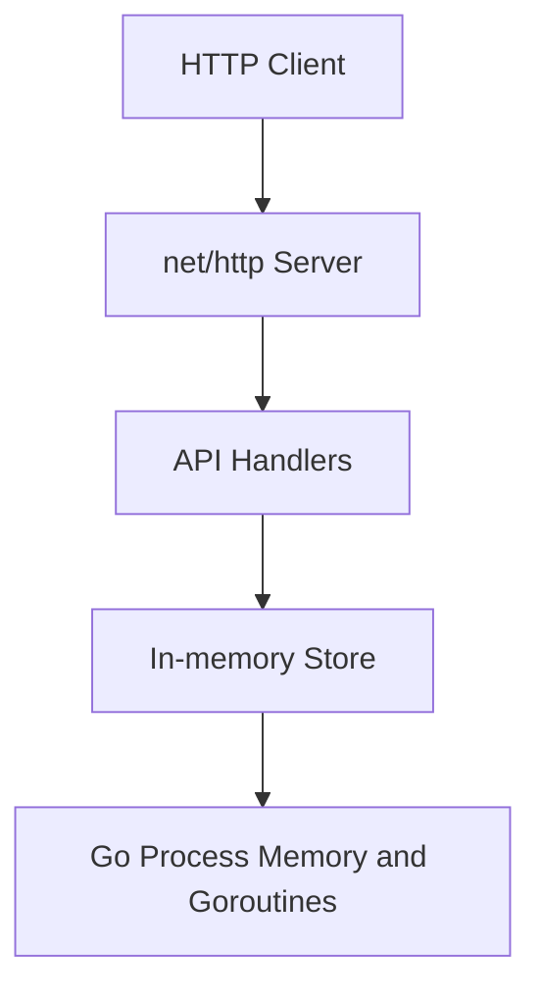

# kvstore - Observability

> Generated by /audit. Last updated: 2026-04-08

## Table of Contents

1. [Service Overview](#service-overview)
2. [Architecture](#architecture)
3. [Components](#components)
4. [Fault Domains](#fault-domains)
5. [KPI Table](#kpi-table)
6. [Configurability](#configurability)
7. [Alerts](#alerts)
8. [Dashboard Recommendations](#dashboard-recommendations)

---

## Service Overview

| Property | Value |
|----------|-------|
| Service Name | kvstore |
| Language | Go |
| Framework | Go stdlib `net/http` |
| Purpose | In-memory key/value database with a JSON REST API for set/get/delete/list operations |
| Entry Point | `cmd/kvstore/main.go` |
| Existing Instrumentation | OpenTelemetry SDK init, `otelhttp` route instrumentation, runtime metrics, and custom store/API telemetry |

---

## Architecture



---

## Components

### External Components

This service has no external runtime dependencies. State is stored in-process in memory.

### Internal Layers

| Layer | Package/Module | Description |
|-------|----------------|-------------|
| Presentation | `cmd/kvstore/main.go`, `internal/api` | HTTP server bootstrap and JSON REST handlers |
| Business Logic | `internal/api` | Request validation, method enforcement, error-to-status mapping |
| Data Access | `internal/store` | Concurrent in-memory key/value operations and prefix listing |
| Background | None | No workers, schedulers, or async pipelines |

---

## Fault Domains

| Component | Fault Domain | Failure Mode | Impact | Mitigation |
|-----------|--------------|--------------|--------|------------|
| HTTP server | Connectivity | Listener cannot bind or process is unreachable on configured port | Service unavailable to clients | Track startup failures and health probe results |
| HTTP server | Latency | Slow JSON decoding, response encoding, or lock contention in store access | Elevated client latency on CRUD operations | Request duration traces and histograms by route |
| HTTP server | Errors | Invalid JSON, wrong HTTP method, oversized payloads, missing keys | Higher 4xx/5xx rates and degraded client experience | Error counters split by route and status code |
| HTTP server | Capacity | Goroutine growth or too many concurrent requests | Slower responses or process instability | Runtime gauges and in-flight request metrics |
| In-memory store | Latency | Write lock contention or full key scan during prefix listing | Slower `set`, `delete`, and `list` operations | Operation spans and duration metrics by store method |
| In-memory store | Data integrity | Oversized keys/values or missing keys during reads/deletes | Request failures and rejected writes | Validation failure and not-found counters |
| In-memory store | Capacity | Unbounded in-memory growth as keys accumulate | Memory pressure, GC churn, eventual OOM risk | Gauges for key count and stored bytes |
| Process runtime | Availability | Process crash or fatal listen error | Complete outage | Health check visibility and runtime stability metrics |

---

## KPI Table

**Coverage summary**: 10/10 KPIs instrumented (100%)

| Status | KPI | Component | Class | Metric | Trace | Log | Signal Name | Trace-Derivable | Verified |
|--------|-----|-----------|-------|--------|-------|-----|-------------|-----------------|----------|
| OK | HTTP request latency by route | HTTP server | Standard | Yes | Yes | No | `http.server.request.duration` | Yes |  |
| OK | HTTP request throughput by route and method | HTTP server | Standard | Yes | Yes | No | `http.server.request.count` | No |  |
| OK | HTTP error rate by route and status | HTTP server | Standard | Yes | Yes | Yes | `http.server.request.errors` | No |  |
| OK | In-flight HTTP requests | HTTP server | Standard | Yes | No | No | `http.server.active_requests` | No |  |
| OK | Store operation latency by operation | In-memory store | Business | Yes | Yes | No | `kvstore.store.operation.duration` | Yes |  |
| OK | Store operations processed by operation | In-memory store | Business | Yes | Yes | No | `kvstore.store.operation.count` | No |  |
| OK | Not-found responses | In-memory store | Business | Yes | Yes | Yes | `kvstore.store.not_found.count` | No |  |
| OK | Validation failures for invalid keys, values, or JSON | API validation | Business | Yes | Yes | Yes | `kvstore.validation.failure.count` | No |  |
| OK | Current key count | In-memory store | Business | Yes | No | No | `kvstore.store.keys` | No |  |
| OK | Go runtime goroutines | Process runtime | Standard | Yes | No | No | `process.runtime.go.goroutines` | No |  |

### Legend

- **Status**: `OK` = already instrumented in code, blank = needs implementation
- **Class**: Standard = auto-instrumentation provides this, Business = custom code required
- **Trace-Derivable**: Yes = metric can be computed from span duration by the backend

Instrumentation complete: 10 KPIs implemented, 0 remaining gaps.

---

## Configurability

Observability is initialized in `cmd/kvstore/otel.go` and can be configured entirely with environment variables.

### Environment Variables

| Variable | Default | Description |
|----------|---------|-------------|
| `PORT` | `8080` | HTTP listen port |
| `OTEL_SDK_DISABLED` | `false` | Disable OTel initialization entirely |
| `OTEL_EXPORTER_OTLP_ENDPOINT` | `http://localhost:4318` | OTLP collector endpoint |
| `OTEL_SERVICE_NAME` | `kvstore` | Telemetry service name |
| `OTEL_BSP_SCHEDULE_DELAY` | SDK default | Trace batch flush delay override for local verification |
| `OTEL_METRIC_EXPORT_INTERVAL` | `60000` | Metric export interval in milliseconds |

### Disabling Observability

Run without telemetry collection:

```bash
OTEL_SDK_DISABLED=true go run ./cmd/kvstore
```

---

## Alerts

Pending `/provision`. No alert rules generated yet.

| Alert Name | KPI | Condition | Severity | Runbook |
|------------|-----|-----------|----------|---------|
| TBD | HTTP request latency by route | Populate during `/provision` | Warning | Inspect route-level traces and runtime pressure |
| TBD | HTTP error rate by route and status | Populate during `/provision` | Critical | Check recent failing requests and validation/store error spikes |

---

## Dashboard Recommendations

Pending `/provision`. Recommended starting views once telemetry exists:

### Service Health

- Request rate by endpoint and method
- Error rate by route and status code
- Request latency p50, p95, and p99
- Active requests and goroutines

### Store Health

- Store operation latency by operation
- Store operations per second by operation
- Not-found and validation failure rates
- Current key count over time
