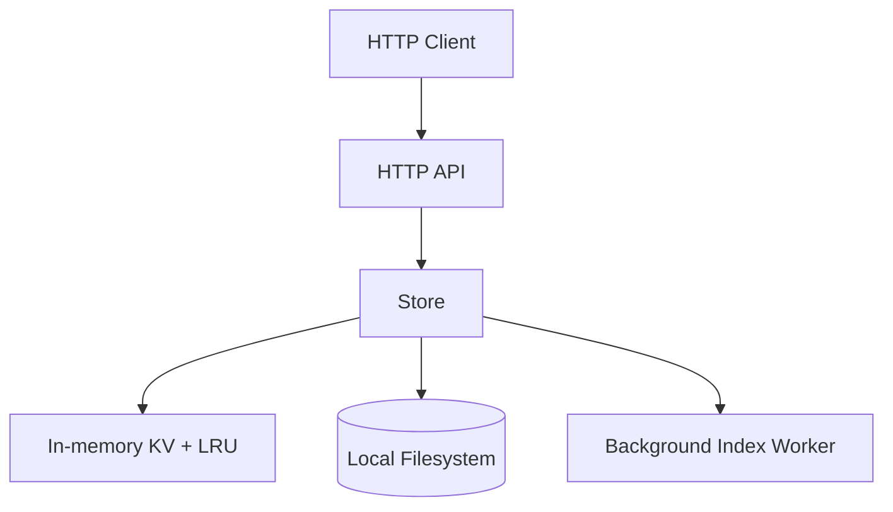

# kvstore - Observability

> Generated by /audit. Last updated: 2026-04-10

## Table of Contents

1. [Service Overview](#service-overview)
2. [Architecture](#architecture)
3. [Components](#components)
4. [Fault Domains](#fault-domains)
5. [KPI Table](#kpi-table)
6. [Configurability](#configurability)
7. [Alerts](#alerts)
8. [Dashboard Recommendations](#dashboard-recommendations)

---

## Service Overview

| Property | Value |
|----------|-------|
| Service Name | `kvstore` |
| Language | Go |
| Framework | Go stdlib `net/http` |
| Purpose | In-memory key/value store with async filesystem persistence and a word-search index |
| Entry Point | `cmd/kvstore-server/main.go` |
| Existing Instrumentation | OpenTelemetry traces and metrics |

---

## Architecture



---

## Components

### External Components

| Component | Type | Technology | Connection |
|-----------|------|------------|------------|
| Local persistence | Storage | Local filesystem | `-data-dir` flag, default `./data` |

### Internal Layers

| Layer | Package/Module | Description |
|-------|----------------|-------------|
| Presentation | `cmd/kvstore-server`, `kvstore/http.go` | HTTP server startup and REST handlers for `set/get/delete/search` |
| Business Logic | `kvstore/store.go` | Key validation, LRU management, async persistence, startup reload |
| Data Access | `kvstore/store.go` | Reads and writes persisted values in the configured data directory |
| Background | `kvstore/store.go` | Goroutine for word-index maintenance and async file persistence |

---

## Fault Domains

| Component | Fault Domain | Failure Mode | Impact | Mitigation |
|-----------|--------------|--------------|--------|------------|
| HTTP API | Latency | Slow handler execution when large payloads are read or store operations stall | Elevated request latency and timeouts | Add HTTP server duration tracing and latency histograms |
| HTTP API | Errors | Invalid keys, oversized payloads, missing keys, or unexpected server failures | 4xx/5xx responses and degraded API usability | Track request/error counts by route and status code |
| HTTP API | Capacity | High request concurrency or large request bodies increase memory and goroutine pressure | Reduced throughput and possible process instability | Add in-flight request and runtime saturation metrics |
| Store / in-memory cache | Capacity | Capacity limit triggers LRU evictions under hot-key churn | Cache misses increase and data may need reload from disk | Emit eviction counters and current item count |
| Store / in-memory cache | Latency | Lock contention or large copies during `Get`/`Set` slow operations | Request latency increases across CRUD endpoints | Add spans around store operations and measure durations |
| Local filesystem persistence | Connectivity | `data-dir` missing permissions or path becomes unavailable | Writes fail and recently accepted data is removed from memory | Emit persistence error counters and failed write spans |
| Local filesystem persistence | Latency | Slow disk writes or startup reload over many files | Delayed write durability and slow startup | Measure persist/load durations |
| Local filesystem persistence | Data Integrity | Corrupt, invalid, or oversized files found during startup | Partial state reload and missing searchable content | Count skipped files and log validation failures |
| Background index worker | Execution | Index goroutine falls behind or stops processing events | Search results become stale or incomplete | Measure queue depth, processing duration, and worker health |
| Background index worker | Availability | Channel backpressure spawns extra goroutines, or worker exits on shutdown timing | Search freshness degrades under bursty writes | Track pending index updates and worker state |

---

## KPI Table

**Coverage summary**: 10/10 KPIs instrumented (100%)

| Status | KPI | Component | Class | Metric | Trace | Log | Signal Name | Trace-Derivable | Verified |
|--------|-----|-----------|-------|--------|-------|-----|-------------|-----------------|----------|
| OK | HTTP request latency by route and method | HTTP API | Standard | Yes | Yes | No | `http.server.request.duration` | Yes |  |
| OK | HTTP request count by route, method, and status | HTTP API | Standard | Yes | Yes | No | `http.server.request.count` | No |  |
| OK | HTTP error rate by route and status | HTTP API | Standard | Yes | Yes | Yes | `http.server.request.errors` | No |  |
| OK | Store operation duration by operation | Store | Business | Yes | Yes | No | `kvstore.store.operation.duration` | Yes |  |
| OK | Store operation failures by operation | Store | Business | Yes | Yes | Yes | `kvstore.store.operation.errors` | No |  |
| OK | Async persistence duration | Local persistence | Business | Yes | Yes | No | `kvstore.persistence.write.duration` | Yes |  |
| OK | Async persistence failures | Local persistence | Business | Yes | Yes | Yes | `kvstore.persistence.write.errors` | No |  |
| OK | Startup reload duration | Local persistence | Business | Yes | Yes | No | `kvstore.persistence.load.duration` | Yes |  |
| OK | LRU eviction count | Store | Business | Yes | No | Yes | `kvstore.store.evictions.count` | No |  |
| OK | Index backlog depth | Background index worker | Business | Yes | No | No | `kvstore.index.backlog` | No |  |

### Legend

- **Status**: `OK` = instrumented in code, blank = needs implementation
- **Class**: `Standard` = auto-instrumentation provides this, `Business` = custom code required
- **Trace-Derivable**: `Yes` = metric can be computed from span duration by the backend

---

## Configurability

Observability should remain toggleable without code changes once instrumentation is added.

### Service Configuration

| Variable/Flag | Default | Description |
|---------------|---------|-------------|
| `-addr` | `:8080` | HTTP listen address |
| `-data-dir` | `./data` | Filesystem path used for persistence |
| `-capacity` | `1024` | Maximum number of key/value pairs kept in memory |

### Recommended OTel Environment Variables

| Variable | Default | Description |
|----------|---------|-------------|
| `OTEL_SDK_DISABLED` | `false` | Disable all OTel instrumentation |
| `OTEL_EXPORTER_OTLP_ENDPOINT` | `http://localhost:4318` | OTLP collector endpoint |
| `OTEL_SERVICE_NAME` | `kvstore` | Service name reported in telemetry |
| `OTEL_BSP_SCHEDULE_DELAY` | `5000` | Trace export batch interval in milliseconds |
| `OTEL_METRIC_EXPORT_INTERVAL` | `60000` | Metric export interval in milliseconds |

### Disabling Observability

```bash
OTEL_SDK_DISABLED=true go run ./cmd/kvstore-server
```

---

## Alerts

Provisioning placeholder. Generated alert rules will be added here by `/provision` after KPI verification.

---

## Dashboard Recommendations

Provisioning placeholder. Dashboard specifications will be added here by `/provision` after KPI verification.
