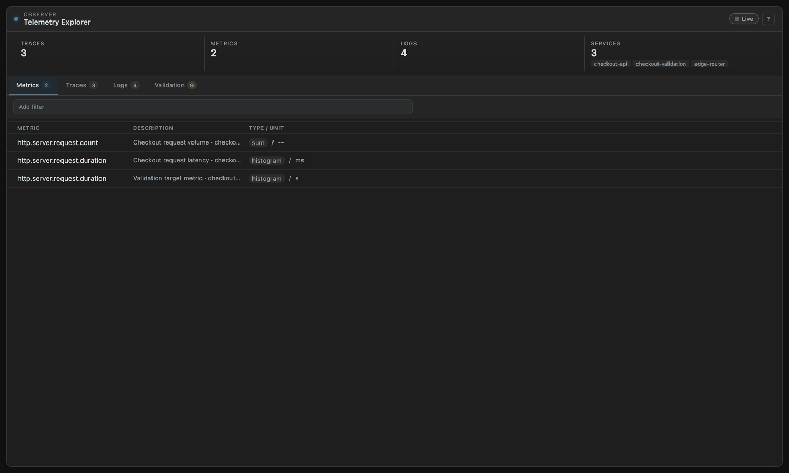
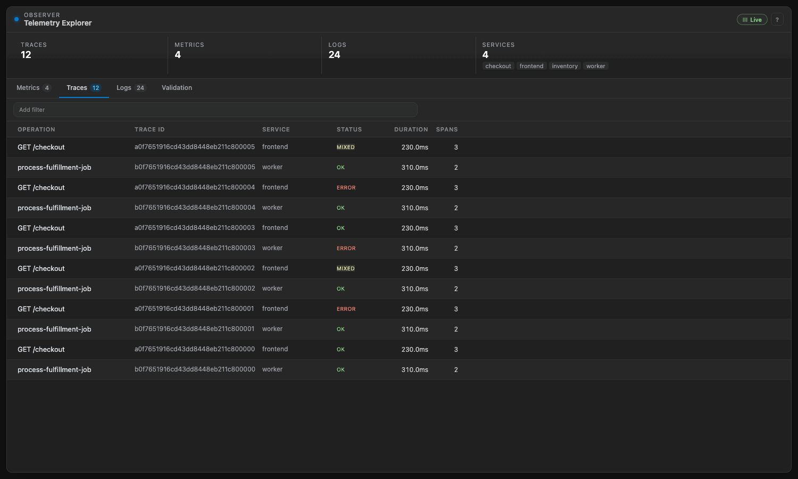
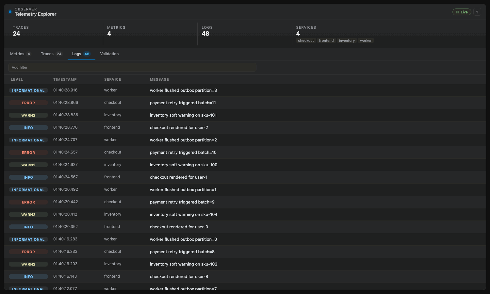
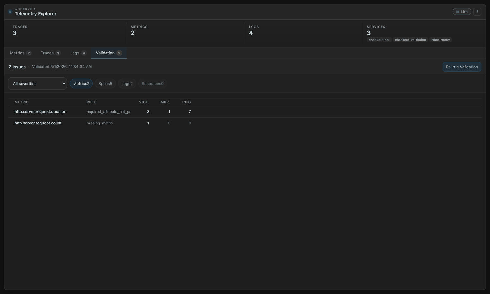

# Splunk Observability Studio

Splunk Observability Studio brings a local OpenTelemetry collector and Telemetry Explorer into VS Code.

When the extension activates, it reuses or starts a bundled `obstudio` backend and exposes OTLP receivers on localhost. Open the embedded Observer UI with `Splunk Observability Studio: Open Observer` from the Command Palette. The `Observer` status bar item appears on activation and opens the Observer status menu for reopen, restart, and log actions.

## Quick Start

1. Install the extension.
2. Run `Splunk Observability Studio: Open Observer`.
3. Send telemetry to `127.0.0.1:4318` (OTLP/HTTP) or `127.0.0.1:4317` (OTLP/gRPC).
4. Use the Metrics, Traces, Logs, and Validation tabs to inspect what arrived.

Use the `Live` button in the top-right corner of the Explorer to pause the stream while you inspect a trace, metric, or log. Pause freezes traces, metrics, logs, and summary counts on the current view. Validation continues to update.

## Metrics Explorer

Inspect live metric series, compare dimensions, and drill into retained points directly inside VS Code.



## Trace Investigation

Open recent traces, expand the waterfall, and use the detail view to see where time was spent and which downstream call failed.



## Log Inspection

Review structured logs alongside severity, resource metadata, and trace correlation details.



## Validation

Validation runs the bundled OpenTelemetry Weaver validator against the spans, metrics, logs, and resources currently retained in Observer. It highlights missing context, naming problems, and malformed telemetry before those issues turn into harder debugging sessions.

It is most useful when you want to answer questions like:

- Did I miss an expected HTTP attribute such as method, route, or status code?
- Did I name this metric or field in a way other tools may not recognize?
- Is this telemetry technically valid, but missing context that would make it more useful?

Results are grouped by metric, span, log, or resource so you can work through one signal type at a time.

Typical flow:

1. Send telemetry to the local Observer.
2. Open the Validation tab.
3. Click `Run Validation` or `Re-run Validation`.
4. Start with the signal you care about most, then open an issue to see the plain-language finding.

Severity is intentionally simple:

- `Violation` usually means something expected is missing or incorrect.
- `Improvement` means the telemetry is usable, but more detail would help.
- `Information` is low-priority guidance for optional or situation-specific context.



## Features

- Reuses a healthy shared observer at `http://127.0.0.1:3000` or starts a bundled local observer on activation.
- Detects local Codex, Claude Code, and Cursor installs and offers a one-time prompt to enable integration.
- Exposes stable OTLP endpoints for local applications:
  - OTLP/HTTP on `127.0.0.1:4318`
  - OTLP/gRPC on `127.0.0.1:4317`
- Opens the Telemetry Explorer in a VS Code webview panel.
- Keeps a status bar entry available for status, reopen, restart, and log actions.
- Includes commands for starting, stopping, restarting, and reusing the shared observer runtime.
- Includes helper commands to enable agent integrations against the shared observer endpoint.

## Commands

- `Splunk Observability Studio: Open Observer` — opens the Observer webview panel.
- `Splunk Observability Studio: Observer Status` — opens the quick status menu.
- `Splunk Observability Studio: Start Observer` — starts the shared observer runtime.
- `Splunk Observability Studio: Stop Observer` — stops the shared observer runtime.
- `Splunk Observability Studio: Restart Observer` — restarts the shared observer runtime.
- `Splunk Observability Studio: Enable Codex Integration` — installs bundled skills and writes Codex MCP settings for the shared observer.
- `Splunk Observability Studio: Enable Claude Code Integration` — installs bundled skills and writes Claude Code MCP settings for the shared observer.
- `Splunk Observability Studio: Enable Cursor Integration` — installs bundled skills and writes Cursor MCP settings for the shared observer.

## Agent Skills

The extension can point supported AI coding agents at the same local Observer instance used by the VS Code webview.

It does not add new skills inside the webview itself. Instead, it installs the bundled `otel-audit` and `otel-instrument` skills for supported agents and updates their MCP config to use the shared local Observer.

Use it like this:

1. Start the extension-managed Observer, or reuse an existing shared Observer.
2. Accept the one-time integration prompt when Codex, Claude Code, or Cursor is detected, or run one of the `Enable ... Integration` commands from the Command Palette.
3. Restart that agent so it reloads the bundled skills and MCP settings.
4. In the agent, use the syntax that agent expects for the bundled skills:
   - Codex-style examples: `$otel-audit`, `$otel-instrument`
   - Slash-command style examples: `/otel-audit`, `/otel-instrument`

For the full skill reference, use the repo docs:

- [Core skills overview](https://github.com/signalfx/obstudio/blob/main/README.md#core-skills)
- [README: Using The Skills](https://github.com/signalfx/obstudio/blob/main/README.md#using-the-skills)
- [User guide: Using Skills](https://github.com/signalfx/obstudio/blob/main/docs/USER.md#using-skills)

## Configuration

To run the extension-managed Observer on a different local UI/MCP port, set:

```json
{
  "observability-studio.managedObserverPort": 41234
}
```

This is the extension equivalent of `obstudio --observer-http-port 41234`.
The extension-managed OTLP receiver ports stay fixed at `4318` and `4317`.

## How It Works

The extension packages a pre-built observer binary (Go) into the extension bundle under `dist/observer/obstudio`. The binary embeds its own web UI via Go's `//go:embed` directive.

At startup, the extension:

1. Uses `observability-studio.sharedObserverUrl` when it is configured.
2. Otherwise reuses a healthy observer already serving `http://127.0.0.1:3000` when one is available.
3. If no shared observer is already running, verifies that `managedObserverPort`, `4317`, and `4318` are available.
4. Launches the bundled observer binary on the managed local endpoint `http://127.0.0.1:<managedObserverPort>`.
5. When a supported agent home is detected, offers a one-time prompt to install bundled skills and point that agent at the shared Observer MCP endpoint.
6. Connects the VS Code webview to the Observer UI via an iframe.

If the managed endpoint or either OTLP port is already in use by an incompatible service, the extension reports a startup error.

## Requirements

- VS Code `^1.82.0`
- No additional runtime setup is required for normal extension use.
- To build the extension from source, install Node.js, `npm`, and the Go toolchain, and make sure `go version` works in your shell before running the build scripts.

## Development

From a full repo checkout, run these commands from the `extension` directory. The build expects the sibling `observer/` and `skills/` directories from this repository to be present:

- Confirm the Go toolchain is available in your shell with `go version`.
- `npm ci` — install local dependencies before running the build or test scripts.
- `npm run compile` — type-checks, lints, builds the Go binary, and bundles the extension.
- `npm run package` — production build.
- `npm run build:vsix` — packages the extension into a `.vsix` file.
- `npm run test:unit` — runs unit tests.
- `npm run test:all` — runs unit, integration, and VS Code host tests.

## Known Limitations

- The managed local observer expects `127.0.0.1:<managedObserverPort>`, `127.0.0.1:4318`, and `127.0.0.1:4317` to be free unless you point the extension at an existing shared observer with `observability-studio.sharedObserverUrl`.
