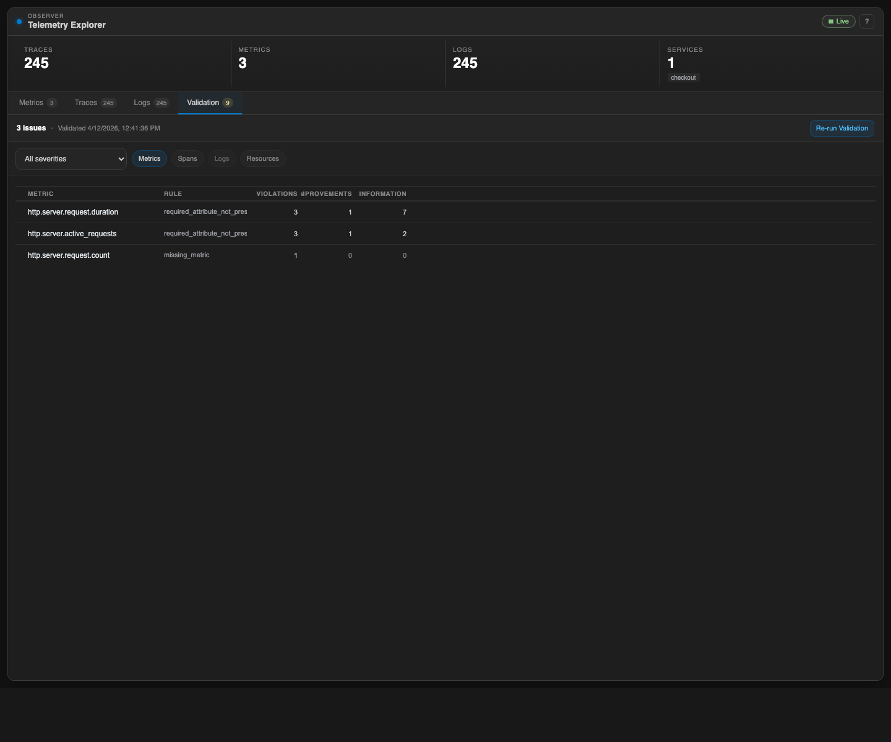

# Observability Studio

Observability Studio is a VS Code extension for viewing OpenTelemetry data locally while you work.

When the extension activates, it starts or reuses an observer backend, exposes OTLP receivers on localhost, and opens an embedded Observer UI inside VS Code.

The embedded webview serves the same Observer UI shown below:

## Features

- Starts a local observer backend automatically on extension activation.
- Reuses a configured shared backend when `observability-studio.sharedObserverUrl` is set.
- Exposes default local OTLP endpoints for local applications:
  - OTLP/HTTP on `127.0.0.1:4318`
  - OTLP/gRPC on `127.0.0.1:4317`
- Provides a guided setup flow for backend mode, ports, and MCP configuration.
- Opens the Observer UI in a VS Code webview panel.
- Includes a status bar entry to reopen the Observer quickly.

## Commands

- `Observability Studio: Open Observer` — opens the Observer webview panel.
- `Observability Studio: Setup Observer` — choose backend mode, local ports, and configure MCP for Codex, Claude Code, or Cursor.

## How to Use It

1. Open the Command Palette and run `Observability Studio: Setup Observer`.
2. Choose `Reuse existing backend` or `Start local backend`.
3. If you choose local mode, keep the default ports or enter custom UI / OTLP HTTP / OTLP gRPC ports.
4. Choose the MCP target to configure: `Codex`, `Claude Code`, or `Cursor`.
5. Open the status menu and use `Open Observer` to launch the embedded webview.

The Observer status menu keeps the running-state actions in this order:

1. `Open Observer`
2. `Configure Observer...`
3. `Restart Observer`
4. `Stop Observer`
5. `Show Output Log`

## How It Works

The extension packages a pre-built observer binary (Go) into the extension bundle under `dist/observer/obstudio`. The binary embeds its own web UI via Go's `//go:embed` directive.

At startup, the extension:

1. Reads the configured backend mode and local port settings.
2. Reuses a shared backend when `observability-studio.sharedObserverUrl` is set.
3. Otherwise launches the bundled observer binary with the configured local UI / OTLP ports.
4. Connects the VS Code webview to the selected Observer UI via an iframe.

Use **Configure Observer...** from the Observer status menu to switch between shared and local mode or to choose custom ports.

## Requirements

- VS Code `^1.110.0`
- Go compiler for building from source

No additional runtime setup is required for normal extension use.

## Development

From the `extension` directory:

- `npm run compile` — type-checks, lints, builds the Go binary, and bundles the extension.
- `npm run package` — production build.
- `npm run build:vsix` — packages the extension into a `.vsix` file.
- `npm run test:unit` — runs unit tests.

## Settings

- `observability-studio.sharedObserverUrl`
- `observability-studio.localObserverPort`
- `observability-studio.localOtlpHttpPort`
- `observability-studio.localOtlpGrpcPort`
