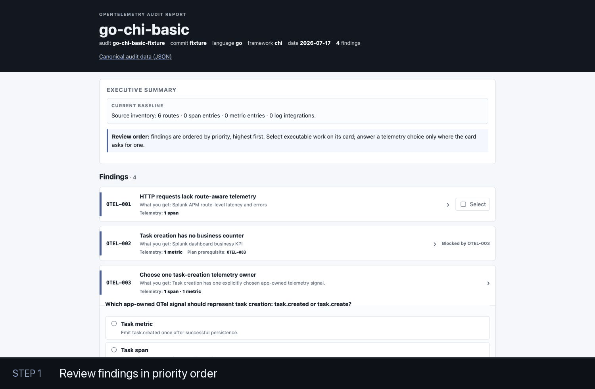
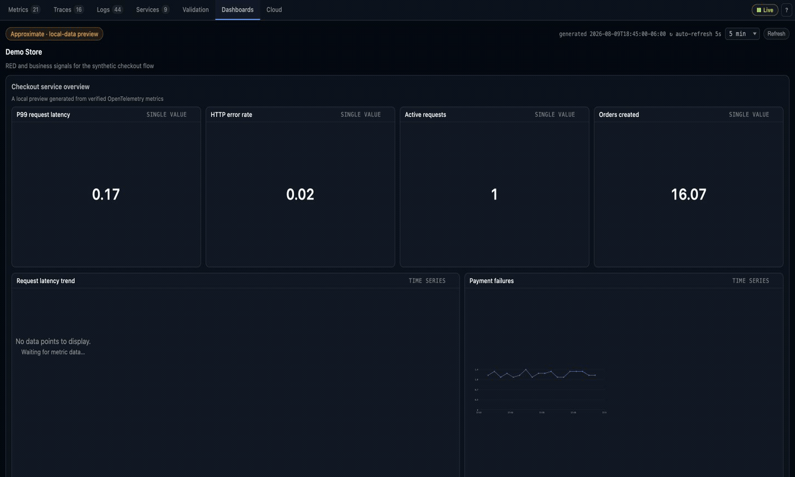

# Splunk Observability Studio

Give your coding agent an evidence-backed OpenTelemetry workflow, then inspect the proof without leaving your editor.

Splunk Observability Studio combines agent skills for auditing, instrumenting, verifying, and operationalizing telemetry with a local Observer for traces, metrics, logs, services, validation, dashboard previews, and optional Splunk Observability Cloud export.



## Quick start

### Cursor

1. Install from [Open VSX](https://open-vsx.org/extension/splunk/observability-studio) in Cursor's Extensions view.
2. Run **Splunk Observability Studio: Open Observer**.
3. Accept the detected Cursor prompt. If it does not appear, run **Splunk Observability Studio: Enable Cursor Integration**.
4. Restart Cursor so it reloads the installed skills and local Observer connection.

### Kiro

1. Install from [Open VSX](https://open-vsx.org/extension/splunk/observability-studio) in Kiro's Extensions view.
2. Run **Splunk Observability Studio: Open Observer**.
3. Accept the detected Kiro prompt. If it does not appear, run **Splunk Observability Studio: Enable Kiro Integration**.
4. Restart Kiro so it reloads the installed skills and local Observer connection.

### Visual Studio Code

1. Install from the [Visual Studio Marketplace](https://marketplace.visualstudio.com/items?itemName=Splunk.observability-studio).
2. Run **Splunk Observability Studio: Open Observer**.
3. Accept the detected integration prompt. If it does not appear, run **Splunk Observability Studio: Enable Claude Code Integration** or **Enable Codex Integration** for the agent you use.
4. Restart Claude Code or Codex so it reloads the installed skills and local Observer connection.

### Start here — run the audit

Open your service directory, then enter the matching command in your coding agent chat—not in the terminal.

**Codex**

```text
$otel-audit
```

**Claude Code, Cursor, or Kiro**

```text
/otel-audit
```

The GIF begins at Step 1 after this command returns the audit report. Review the prioritized findings, select the work, and run the generated instrumentation command. In a slash-command agent, use `/otel-instrument` where the report shows `$otel-instrument`; keep its generated IDs, decisions, and service path unchanged.

## Choose the skill for the job

Use the skills as a guided path from source code to proven telemetry:

```text
audit → review and select → instrument → verify → configure → publish
```

The table uses Codex `$` notation. In Claude Code, Cursor, or Kiro, replace the leading `$` with `/` for every listed skill; keep its name and arguments unchanged.

| Skill | Use it when you want to… |
|---|---|
| `$otel-audit` | Read the codebase without changing application code, find coverage gaps, and review a prioritized interactive report. |
| `$otel-instrument` | Implement only the approved findings or a concrete telemetry request. Verification runs by default after the change. |
| `$otel-verify` | Recheck existing instrumentation with project-runtime, app-code, and optional local OTLP proof. |
| `$splunk-dashboard` | Generate dashboard Terraform from source-backed metrics in the audit report and preview the layout against local data in Observer. |
| `$splunk-configure` | Generate evidence-backed detector and dashboard Terraform, while calling out instrumentation prerequisites that still block safe resources. |
| `$splunk-detector-publish` | Diff detector specs against live Splunk state, confirm the gaps, and create only what is missing. |
| `$splunk-dashboard-publish` | Diff dashboard groups, dashboards, and charts, confirm the gaps, and publish them safely. |

### Continue the workflow

1. When the audit finishes, open the interactive report link shown in agent chat.
2. Review the prioritized findings and select the work you approve.
3. Copy the report's generated instrumentation command. Run it in agent chat using the prefix shown above; do not remove its generated IDs, decisions, or service path.
4. Review the verification result that runs by default after instrumentation.
5. Use `$splunk-dashboard` to preview a dashboard, then `$splunk-dashboard-publish` to review the live diff and create only confirmed gaps.

You can also ask naturally, for example: “Audit this checkout service, let me approve the plan, then instrument only the selected gaps.”

## See the proof locally

When the extension starts its bundled Observer, it exposes these local endpoints:

| Service | Extension-managed endpoint |
|---|---|
| OTLP/HTTP | `http://127.0.0.1:4318` |
| OTLP/gRPC | `127.0.0.1:4317` |
| Observer UI and REST | `http://127.0.0.1:3000` by default |
| Local Observer MCP | `http://127.0.0.1:3000/mcp` by default |

If the extension reuses a shared Observer, use that Observer's configured UI, MCP, and OTLP receiver endpoints. A manually configured `sharedObserverUrl` does not remap or validate the shared Observer's OTLP ports.

The extension-managed Observer keeps telemetry local unless you explicitly enable Splunk Observability Cloud export. A shared Observer follows its own export configuration.

Observer provides seven focused views:

| View | What it helps you prove |
|---|---|
| **Metrics** | Series, dimensions, retained points, distributions, and resource metadata. |
| **Traces** | End-to-end waterfalls, downstream latency, errors, span attributes, and GenAI agent flow. |
| **Logs** | Structured messages, severity, resources, attributes, and trace correlation. |
| **Services** | Trace and span volume, errors, and client/server duration by service. |
| **Validation** | OpenTelemetry semantic-convention findings across metrics, spans, logs, and resources. |
| **Dashboards** | An approximate local-data preview of Terraform generated by the dashboard skills. |
| **Cloud** | Optional Splunk Observability Cloud connection and export controls. |

### Investigate a checkout trace

Open a trace to see the complete waterfall and identify the slow dependency.


### Preview a generated dashboard

Use `$splunk-dashboard`, then inspect the generated layout against the telemetry retained locally. The preview is clearly labeled approximate because SignalFlow executes in Splunk Observability Cloud. Observer reads the workspace that launched its process. After switching workspaces or repositories, run **Restart Observer** if the extension manages it. If you reuse a shared Observer, relaunch that process from the intended workspace, then run **Restart Observer** to reconnect.



### Inspect metrics and logs

Filter a metric by service, open the retained series, and compare values without leaving the editor.


Filter structured logs to the affected service, then inspect the message, resource, scope, and attributes.


### Validate semantic conventions

Run the bundled OpenTelemetry Weaver validator, filter findings by severity and signal, then open an issue for actionable detail.


The demo media uses synthetic fixtures and telemetry, including the `demo-store` service, `order.demo-1042`, a 450 ms DemoPay timeout, and a five-minute checkout dashboard. It contains no production identifiers or credentials.

## Commands

- **Splunk Observability Studio: Open Observer** — open the local visualization panel.
- **Splunk Observability Studio: Observer Status** — reopen, restart, or inspect the Observer runtime.
- **Splunk Observability Studio: Start Observer**, **Stop Observer**, **Restart Observer** — manage the extension-owned process, or connect, disconnect, and reconnect when using a shared Observer.
- **Splunk Observability Studio: Enable Claude Code Integration** — install the bundled skills and configure the local MCP endpoint for Claude Code.
- **Splunk Observability Studio: Enable Codex Integration** — install the bundled skills and configure the local MCP endpoint for Codex.
- **Splunk Observability Studio: Enable Cursor Integration** — install the bundled skills and configure the local MCP endpoint for Cursor.
- **Splunk Observability Studio: Enable Kiro Integration** — install the bundled skills and configure the local MCP endpoint for Kiro.

The standalone release CLI also supports integrations that are not offered as extension Command Palette actions:

- `obstudio install --target copilot` configures the local MCP connection for GitHub Copilot in Visual Studio Code. Agent-skill installation is not supported for this target.
- `obstudio install --target windsurf` installs the bundled skills and configures the local MCP connection for Windsurf.

Use the **Live** control, or press `P` while Observer is focused, to pause telemetry while inspecting a row. Standard editor shortcuts such as `Cmd+P` and `Ctrl+P` continue to work.

## Configuration

Move the extension-managed Observer UI and MCP endpoint to another local port with:

```json
{
  "observability-studio.managedObserverPort": 41234
}
```

For an extension-managed Observer, the OTLP receivers remain fixed at `4318` and `4317`. Set `observability-studio.sharedObserverUrl` to reuse an Observer you already manage, then send telemetry to the receiver endpoints configured by that Observer.

## Local by default

- An extension-managed Observer retains incoming telemetry locally for development inspection. A shared Observer follows its own retention and export configuration.
- The Cloud tab exports metrics and traces only. Its key is stored in IDE secret storage, and a new connection leaves remote export off until you explicitly enable it.
- Optional remote Splunk MCP setup connects the coding agent to remote tools; it is separate from telemetry export.
- Publishing skills show a diff and require confirmation before creating missing detectors or dashboards.
- Access tokens are not part of the demo media and should be supplied only through the supported local configuration flow.

## Troubleshooting

- If the extension-managed Observer cannot start, check its configured UI/MCP port (`managedObserverPort`, `3000` by default) and the fixed receiver ports `4318` and `4317`. Choose another `managedObserverPort` if its UI/MCP port is already used.
- If the extension cannot connect to a shared Observer, verify `sharedObserverUrl`. If its UI loads but telemetry does not arrive, use the OTLP receiver endpoints configured by that Observer.
- Restart your coding agent after enabling an integration so it reloads the skills and MCP settings.
- Use **Observer Status** to restart the extension-managed runtime, reconnect a shared Observer, or open the extension logs.

## Requirements and links

- Cursor (compatible release), Kiro, or Visual Studio Code `^1.82.0`.
- No separate collector, web runtime, or Weaver installation is required for normal extension use.
- [User guide](https://github.com/signalfx/obstudio/blob/main/docs/USER.md)
- [Skill documentation](https://github.com/signalfx/obstudio/tree/main/skills)
- [Source and releases](https://github.com/signalfx/obstudio)
- [Contributing](https://github.com/signalfx/obstudio/blob/main/CONTRIBUTING.md)
