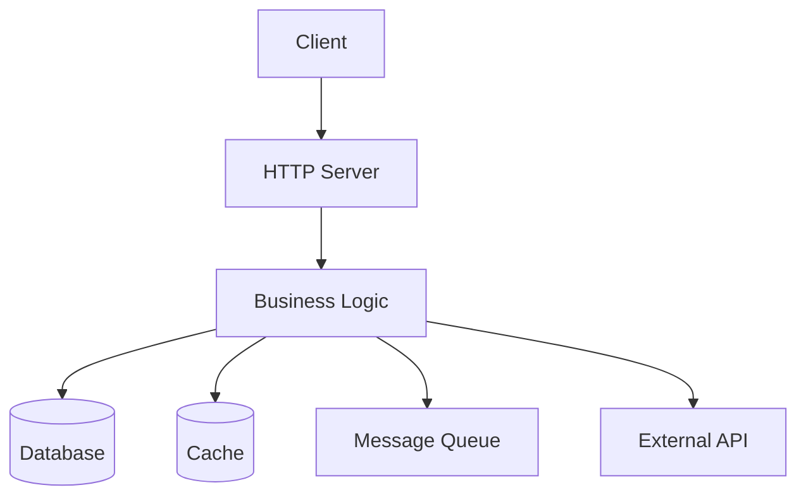

# Inventory Template

Use this template when generating `.observe/inventory.md` in the `/splunk-audit`
skill. Replace all `{placeholder}` values with actual data from the
analysis. Remove sections that do not apply.

Sections 1-9 are populated by `/splunk-audit`.

---

```markdown
# {Service Name} - Observability

> Generated by /audit. Last updated: {date}

## Table of Contents

1. [Service Overview](#service-overview)
2. [Architecture](#architecture)
3. [Components](#components)
4. [Fault Domains](#fault-domains)
5. [SLI Definitions](#sli-definitions)
6. [Spans](#spans)
7. [Metrics](#metrics)
8. [Logs](#logs)
9. [Configurability](#configurability)

---

## Service Overview

| Property | Value |
|----------|-------|
| Service Name | {service_name} |
| Language | {language} |
| Framework | {framework} |
| Purpose | {one-line description} |
| Entry Point | {path to main} |
| Existing Instrumentation | {OTel / Prometheus / None / etc.} |

---

## Architecture

{Insert mermaid diagram or ASCII art showing component interactions}



---

## Components

### External Components

| Component | Type | Technology | Connection |
|-----------|------|------------|------------|
| {name} | Database / Cache / Queue / API / Storage | {Redis, Postgres, Kafka, etc.} | {connection string pattern or env var} |

### Internal Layers

| Layer | Package/Module | Description |
|-------|----------------|-------------|
| Presentation | {path} | HTTP handlers, API endpoints |
| Business Logic | {path} | Core services, domain logic |
| Data Access | {path} | Repository, ORM, data layer |
| Background | {path} | Workers, schedulers, health checks |

---

## Fault Domains

| Component | Fault Domain | Failure Mode | Impact | Mitigation |
|-----------|--------------|--------------|--------|------------|
| {component} | {connectivity/latency/data/capacity/availability} | {what can go wrong} | {user/system impact} | {existing or recommended mitigation} |

---

## SLI Definitions

| SLI | Golden Signal | Component | Target |
|-----|---------------|-----------|--------|
| {sli_name} | Latency / Traffic / Errors / Saturation | {component} | {target threshold or --} |

---

## Spans

**Coverage**: {instrumented}/{total} spans instrumented

| Signal Name | Category | Component | SLIs | Status | Verified |
|-------------|----------|-----------|------|--------|----------|
| `{span_name}` | OOB | {component} | {sli_1}, {sli_2} | OK | OK |
| `{span_name}` | Custom | {component} | {sli_name} | | |

---

## Metrics

**Coverage**: {instrumented}/{total} metrics instrumented

| Signal Name | Type | Category | Component | SLIs | Unit | Status | Verified |
|-------------|------|----------|-----------|------|------|--------|----------|
| `{metric_name}` | Histogram | Derived | {component} | {sli_name} | s | OK | OK |
| `{metric_name}` | Counter | OOB | {component} | {sli_name} | {requests} | OK | |
| `{metric_name}` | Counter | Custom | {component} | {sli_name} | {unit} | | |

---

## Logs

**Coverage**: {instrumented}/{total} log signals instrumented

| Signal Name | Category | Component | SLIs | Level | Status | Verified |
|-------------|----------|-----------|------|-------|--------|----------|
| `{log_event_name}` | Custom | {component} | {sli_name} | ERROR | | |

### Legend

- **Status**: OK = already instrumented in code, blank = needs implementation
- **Verified**: OK = confirmed flowing to collector by `/splunk-verify`, blank = not yet validated
- **Category**:
  - **OOB** = out-of-the-box from auto-instrumentation libraries
  - **Custom** = requires hand-written instrumentation code
  - **Derived** = backend computes from span data (metrics only)

---

## Configurability

Observability can be toggled without code changes.

### Environment Variables

| Variable | Default | Description |
|----------|---------|-------------|
| `OTEL_SDK_DISABLED` | `false` | Disable all OTel instrumentation |
| `OTEL_TRACES_EXPORTER` | `otlp` | Trace exporter (`otlp`, `none`) |
| `OTEL_METRICS_EXPORTER` | `otlp` | Metrics exporter (`otlp`, `none`) |
| `OTEL_LOGS_EXPORTER` | `otlp` | Logs exporter (`otlp`, `none`) |
| `OTEL_EXPORTER_OTLP_ENDPOINT` | `http://localhost:4318` | OTLP collector endpoint |
| `OTEL_SERVICE_NAME` | `{service_name}` | Service name in telemetry |
| `OTEL_TRACES_SAMPLER_ARG` | `1.0` | Trace sampling rate (0.0-1.0) |

{Add any service-specific config entries here, e.g. config.yaml fields}

### Disabling Observability

To run without observability overhead:

```bash
OTEL_SDK_DISABLED=true ./your-service
```

When disabled, OTel API calls (spans, metrics, logs) become no-ops with
negligible performance impact.

```
