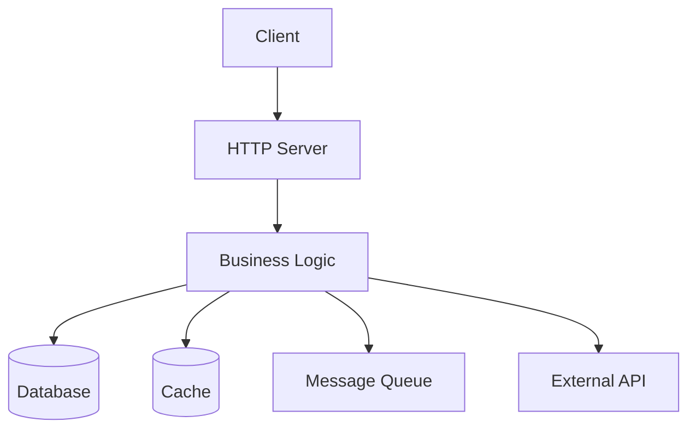

# Inventory Template

Use this template when generating `.observe/inventory.md` in the `/audit`
skill. Replace all `{placeholder}` values with actual data from the
analysis. Remove sections that do not apply.

Sections 1-6 are populated by `/audit`. Section 7 (Alerts) and Section 8
(Dashboard Recommendations) are populated by `/provision`.

---

```markdown
# {Service Name} - Observability

> Generated by /audit. Last updated: {date}

## Table of Contents

1. [Service Overview](#service-overview)
2. [Architecture](#architecture)
3. [Components](#components)
4. [Fault Domains](#fault-domains)
5. [KPI Table](#kpi-table)
6. [Configurability](#configurability)
7. [Alerts](#alerts)
8. [Dashboard Recommendations](#dashboard-recommendations)

---

## Service Overview

| Property | Value |
|----------|-------|
| Service Name | {service_name} |
| Language | {language} |
| Framework | {framework} |
| Purpose | {one-line description} |
| Entry Point | {path to main} |
| Existing Instrumentation | {OTel / Prometheus / None / etc.} |

---

## Architecture

{Insert mermaid diagram or ASCII art showing component interactions}



---

## Components

### External Components

| Component | Type | Technology | Connection |
|-----------|------|------------|------------|
| {name} | Database / Cache / Queue / API / Storage | {Redis, Postgres, Kafka, etc.} | {connection string pattern or env var} |

### Internal Layers

| Layer | Package/Module | Description |
|-------|----------------|-------------|
| Presentation | {path} | HTTP handlers, API endpoints |
| Business Logic | {path} | Core services, domain logic |
| Data Access | {path} | Repository, ORM, data layer |
| Background | {path} | Workers, schedulers, health checks |

---

## Fault Domains

| Component | Fault Domain | Failure Mode | Impact | Mitigation |
|-----------|--------------|--------------|--------|------------|
| {component} | {connectivity/latency/data/capacity/availability} | {what can go wrong} | {user/system impact} | {existing or recommended mitigation} |

---

## KPI Table

**Coverage summary**: {checked_count}/{total_count} KPIs instrumented ({percentage}%)

| Status | KPI | Component | Class | Metric | Trace | Log | Signal Name | Trace-Derivable |
|--------|-----|-----------|-------|--------|-------|-----|-------------|-----------------|
| ✅ | {kpi_name} | {component} | Standard | Yes | Yes | No | {signal_name} | {Yes/No} |
|    | {kpi_name} | {component} | Business | Yes | No | Yes | {signal_name} | {No} |

### Legend

- **Status**: ✅ = already instrumented in code, blank = needs implementation
- **Class**: Standard = auto-instrumentation provides this, Business = custom code required
- **Trace-Derivable**: Yes = metric can be computed from span duration by the backend

---

## Configurability

Observability can be toggled without code changes.

### Environment Variables

| Variable | Default | Description |
|----------|---------|-------------|
| `OTEL_SDK_DISABLED` | `false` | Disable all OTel instrumentation |
| `OTEL_TRACES_EXPORTER` | `otlp` | Trace exporter (`otlp`, `none`) |
| `OTEL_METRICS_EXPORTER` | `otlp` | Metrics exporter (`otlp`, `none`) |
| `OTEL_LOGS_EXPORTER` | `otlp` | Logs exporter (`otlp`, `none`) |
| `OTEL_EXPORTER_OTLP_ENDPOINT` | `http://localhost:4318` | OTLP collector endpoint |
| `OTEL_SERVICE_NAME` | `{service_name}` | Service name in telemetry |
| `OTEL_TRACES_SAMPLER_ARG` | `1.0` | Trace sampling rate (0.0-1.0) |

{Add any service-specific config entries here, e.g. config.yaml fields}

### Disabling Observability

To run without observability overhead:

```bash
OTEL_SDK_DISABLED=true ./your-service
```

When disabled, OTel API calls (spans, metrics, logs) become no-ops with
negligible performance impact.

---

## Alerts

| Alert Name | KPI | Condition | Severity | Runbook |
|------------|-----|-----------|----------|---------|
| {alert_name} | {kpi_name} | {threshold expression} | {Critical/Warning/Info} | {brief response action} |

### Severity Definitions

- **Critical**: Page on-call immediately. Service is down, data loss risk,
  or complete functionality loss.
- **Warning**: Create a ticket. Degraded performance, approaching resource
  limits, or partial failures.
- **Info**: Dashboard-only. Notable events for awareness, not immediately
  actionable.

---

## Dashboard Recommendations

### Service Health

- Request rate by endpoint (line chart)
- Error rate by status code (line chart)
- Latency percentiles p50/p95/p99 (line chart)
- Active connections (gauge)

### {Primary Data Store} Health

- Operation latency p95 (line chart)
- Connection pool utilization (gauge)
- Error rate by operation (line chart)

### Business Metrics

- {domain-specific metric 1} over time (line chart)
- {domain-specific metric 2} current value (single stat)
- {domain-specific metric 3} by category (bar chart)

### System Resources

- Memory usage: heap, stack (line chart)
- CPU usage (line chart)
- Goroutine/thread count (line chart)
- GC pause time (line chart)
```
